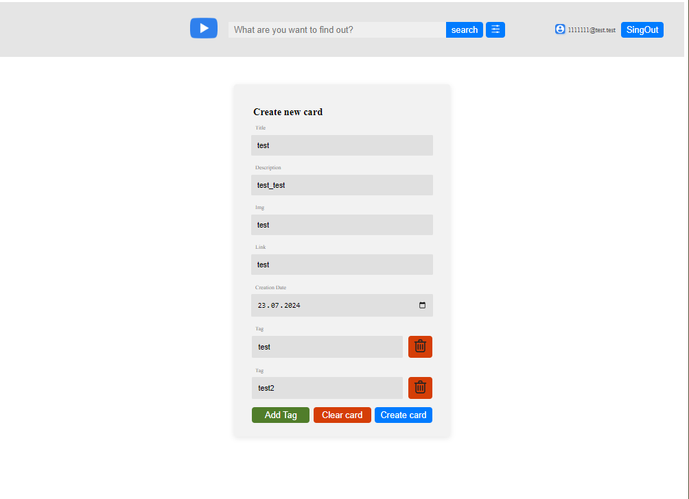

#My angular 17-18 test project.

what needs to be improved:
- [ ] adaptation for mobile devices
- [ ] interaction between components
- [ ] split the code into services
- [ ] write Jest tests
- [ ] manual testing

# Task 1: Angular. Intro task

1. Task: [link](https://github.com/rolling-scopes-school/tasks/blob/master/tasks/angular/intro.md)
2. Screenshot:

3. Done 2024-07-06 / deadline 2024-07-09
4. Score: 70 / 70

- [x] Generated a new Angular project using ng-cli `ng new`
- [x] Migrated Angular application to ESLint with rules AirBnB `npm i eslint-config-airbnb-base`: https://github.com/airbnb/javascript

1. `ng add @angular-eslint/schematics`
2. `npm i eslint-config-airbnb-typescript`
3. `npm i eslint-config-airbnb-base`
4. `npm i eslint-config-airbnb-typescript`
5. `npm i eslint-plugin-simple-import-sort`
6. Updated `.eslintrc.json`
7. Run `ng lint`

- [x] Generated all the necessary components using ng-cli.

```bash
ng generate module components/header
ng generate component components/header
ng generate component components/header/logo
ng generate component components/header/search-input
ng generate component components/header/search-button
ng generate component components/header/filter-button
ng generate component components/header/login-info

ng generate module components/header/filter
ng generate component components/header/filter
ng generate component components/header/filter/sort-buttons
ng generate component components/header/filter/word-filter-input

ng generate module components/search
ng generate component components/search
ng generate component components/search/search-item/
ng generate component components/search/search-results/
ng generate component components/search/search-item/video-thumbnail
ng generate component components/search/search-item/views-count
ng generate component components/search/search-item/likes-count
ng generate component components/search/search-item/dislikes-count
ng generate component components/search/search-item/comments-count
ng generate component components/search/search-item/more-button

ng generate class components/search/search-response.model --type=model
ng generate class components/search/search-item.model --type=model
```

- [x] Created necessary interfaces for YouTube client based on mocked JSON response stored in `.json` file
- [x] ESLint is configured for TypeScript, enabling the no-explicit-any rule.
- [x] TypeScript is configured with `strict: true` rule enabled.


____________

1. Task 2: [link](https://github.com/rolling-scopes-school/tasks/blob/master/tasks/angular/components-directives-pipes.md)
2. Screenshot:

3. Done 08.07.2024 / deadline 09.07.2024
6. Score: 100 /  100
- [x] Main layout is implemented (+10)
- [x] Fake search functionality is implemented: by submitting the form in the Header component, search results are shown (+20)
- [x] The Search result item component contains all the necessary data (+10)
- [x] The Filtering criteria block toggle functionality is implemented (+5)
- [x] The colored border under the Search result item is implemented using a Directive (+15)
- [x] Search result sorting is implemented (both ascending and descending directions) (+15)
- [x] Search result filtering by key words is implemented using a Pipe (+15)
- [x] Custom Button component is implemented and used across the application. The component utilizes [Content projection](https://angular.dev/guide/components/content-projection) to display the button text (+5)
- [x]  At least one of the components is implemented as [standalone](https://angular.dev/guide/components/importing). (+5)


____________

1. Task3: Modules & Services. Routing  [link](https://github.com/rolling-scopes-school/tasks/blob/master/tasks/angular/modules-services-routing.md/)
2. Screenshots:
index page:

login validation:

search page:

detail information:

404 page:


3. Done 22.07.2024 / deadline 23.07.2024
4. Score: 100 / 100
  - [x] The 404 page and redirection logic is implemented (+15)
  - [x] The Login page functionality with necessary rules is implemented (+30)
  - [x] The Detailed information page is implemented (+20)
  - [x] The app.component doesn't include any logic and used only for markup (+15)
  - [x] At least two services (Login service and Youtube service) are implemented (+20)

____________

1. Task 4: forms [link](https://github.com/rolling-scopes-school/tasks/blob/master/tasks/angular/forms.md)
2. Screenshot:
invalid login page:

login page:

invalid admin page


valid admin page



4. Done 24.07.2024 / deadline 30.07.2024
5. Score: 100 / 110
  - [x] Login block is implemented as reactive form (+10)
  - [x] Validation rules are applied to the Login block. Form submission is possible only if all inputs are valid (+15)
  - [x] The application indicates which inputs are invalid on the Login block with appropriate styles and messages (+15)
  - [x] Admin page is implemented as reactive form (+10)
  - [x] Validation rules are applied to the Admin page. Form submission is possible only if all inputs are valid (+15)
  - [x] The application indicates which inputs are invalid on the Admin page with appropriate styles and messages (+15)
  - [x] "Tags" sub-form is implemented using FormArray. "Add tag" button works correctly (+15)
  - [x] "Reset" button functionality is fully implemented (+5)

____________

1. Task 5: rx js observables [link](https://github.com/rolling-scopes-school/tasks/blob/master/tasks/angular/rxjs-observables-http.md)
2. Screenshot:

3. Done 29.07.2024 / deadline 30.07.2024
4. Score: 100 / 100
  - [x] Search input debounce is implemented (+15)
  - [x] Login block reflects the current login state (+15)
  - [x] Search functionality is integrated with the YouTube API (+30)
  - [x] Detailed information page uses a call to the YouTube API (+30)
  - [x] HTTP interceptor is used to pass the token and the base API URL (+10)


____________

1. Task 6: NgRx [link](https://github.com/rolling-scopes-school/tasks/blob/master/tasks/angular/NgRX.md)
2. Screenshots:
header with create custom and favorite buttons:

list of videos:

favorites list:

pagination


3. Done 04.08.2024 / deadline 06.08.2024
4. Score: 100 / 110
  - [x] Admin Page is generated (+5)
  - [x] Favorite Page is generated (+5)
  - [x] NgRx package is used and storage is created (+5)
  - [x] Custom Cards are saved in the store (+10)
  - [x] Videos (with favorite button) from the YouTube API received via Effects are saved in store (+20)
  - [x] Custom Cards (without favorite button) are displayed on List Page combined with YouTube videos (+20)
  - [x] Favorite Page displays all marked videos from List Page or View Page (+10)
  - [x] Clicking the favorite button on the card on Favorite Page removes item from the store and from the page immediately (+15)
  - [x] List Page displays 20 items with pagination and Custom Cards are added to the beginning of the list on 1 page (+10)

____________

1. Task 7: Signals [link](https://github.com/rolling-scopes-school/tasks/blob/master/tasks/angular/signals.md)
2. Screenshot:


 
3. Done 05.08.2024 / deadline 06.08.2024
4. Score: 30 /  30
  - [x] Refactor the API service to use a signal for managing the API request and returning the response data. Implement this in two or more times. (+10)
  - [x] Use a signal to display data in the component's template. Implement this in two or more times. (+10)
  - [x] Convert Observables to Signals using toSignal. Implement this in one or more times. (+10)